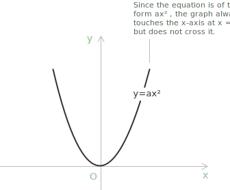

# Incomplete Quadratic Equations

Source: algebrica.org — CC BY-NC 4.0
https://algebrica.org/quadratic-equations/

## Definition

A [quadratic equation](../quadratic-equations/) is considered incomplete when one or both of the terms \\(bx\\) and \\(c\\) are absent from the standard form \\(ax^2 + bx + c = 0\\), provided the term \\(ax^2\\) is present. These equations admit direct solution methods that do not require the [quadratic formula](../quadratic-formula/) or [factorization](../factoring-quadratic-equations/). 

- - -

When both \\(b\\) and \\(c\\) are equal to zero, the equation reduces to:

\\[ax^2 = 0, \quad a \neq 0\\]

Dividing both sides by \\(a\\), which is nonzero by assumption, gives \\(x^2 = 0\\), and the only real solution is \\(x = 0\\) for every admissible value of \\(a\\).

> Graphically, the equation represents a [parabola](../parabola) with its vertex at the origin \\((0, 0)\\), symmetric about the y-axis. The graph opens upward if \\(a > 0\\) and downward if \\(a < 0\\); the magnitude of \\(a\\) determines the width of the parabola. Although the equation has a single solution, the function has a double root at \\(x = 0\\): the x-axis is tangent to the parabola at the origin.

- - -
## The case b = 0

When \\(b = 0\\), the equation takes the form:

\\[ax^2 + c = 0, \quad a \neq 0,\\, c \neq 0\\]

Isolating \\(x^2\\) gives:

\\[x^2 = -\frac{c}{a}\\]

The equation represents a parabola symmetric about the y-axis. When \\(a\\) and \\(c\\) have opposite signs, the quantity \\(-c/a\\) is positive and the equation has two distinct real solutions:

\\[x_{1,2} = \pm\sqrt{-\frac{c}{a}}\\]

The parabola intersects the x-axis in two points symmetric with respect to the origin. When \\(a\\) and \\(c\\) have the same sign, the quantity \\(-c/a\\) is negative and the equation has no real solutions:

\\[-\frac{c}{a} < 0 \implies x \notin \mathbb{R}\\]

The parabola lies entirely above or below the x-axis and does not intersect it.

- - -
## The case c = 0

When \\(c = 0\\), the equation takes the form:

\\[ax^2 + bx = 0, \quad a \neq 0,\\, b \neq 0\\]

Factoring out \\(x\\) gives \\(x(ax + b) = 0\\). Applying the zero product property, either \\(x = 0\\) or \\(ax + b = 0\\), and the equation has two distinct real solutions:

\\[x_1 = 0 \qquad x_2 = -\frac{b}{a}\\]

- - -
## Examples

Consider the equation \\(3x^2 = 0\\). Since both \\(b\\) and \\(c\\) are zero, the only solution is \\(x = 0\\).

- - -

Consider the equation \\(2x^2 - 8 = 0\\). This is of the form \\(ax^2 + c = 0\\) with \\(a = 2\\) and \\(c = -8\\). Since \\(a\\) and \\(c\\) have opposite signs, two real solutions exist. Isolating \\(x^2\\) gives:

\\[x^2 = \frac{8}{2} = 4\\]

Taking the square root of both sides yields the two solutions:

\\[x_{1,2} = \pm\sqrt{4} = \pm 2\\]

- - -

Consider the equation \\(x^2 + 5 = 0\\). Here \\(a = 1\\) and \\(c = 5\\) have the same sign, so \\(-c/a = -5 < 0\\). The equation has [no real solutions](../quadratic-equations-with-complex-solutions/).

- - -

Consider the equation \\(3x^2 - 6x = 0\\). This is of the form \\(ax^2 + bx = 0\\) with \\(a = 3\\) and \\(b = -6\\). Factoring out \\(x\\) gives \\(x(3x - 6) = 0\\), and the two solutions are:

\\[x_1 = 0 \qquad x_2 = \frac{6}{3} = 2\\]

- - -
## A common error to avoid

For equations of the form \\(ax^2 + bx = 0\\), a frequent error consists in dividing both sides by \\(x\\) when the equation is written as:

\\[ax^2 = bx\\]

Dividing by \\(x\\) is not a valid operation here, since \\(x = 0\\) is itself a solution and division by zero is undefined. This manipulation [eliminates the root \\(x = 0\\)](../loss-of-roots/) and reduces the equation to a linear one, producing only the solution \\(x = -b/a\\). The correct approach is to collect \\(x\\) as a common factor, as shown above.